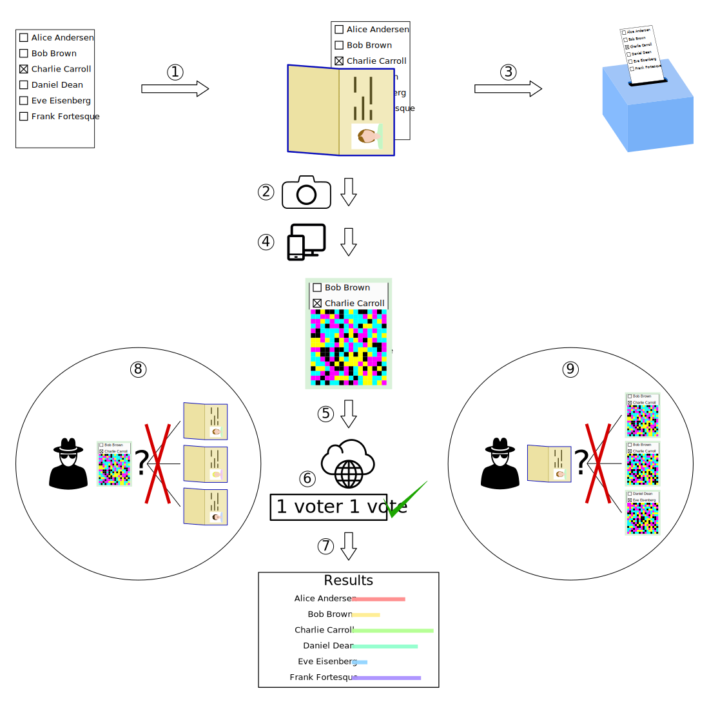

# Welcome to the Sam sabie CVK

Sam sabie CVK (translated as DIY election board) provides protocol and infrastructure to find the result of an election fairly and independently.

## Overview

Here is presented a script how shall a voter to behave using Sam sabie CVK.

1) Make a choice of your candidate/party, mark appropriately.
2) Place your passport below a row with your choice; make a photo of your pass last page together with the ballot.
3) Cast your vote.
4) Encrypt your photo with dedicated application of Sam sabie CVK project. The resulting digital ballot is a picture consists of area of the paper ballot with your choice and a digital signature presented as coloured grid. The coloured grid is dedicated to be recognized by a machine, however, it has human recognizable form. The signature consists of a code for passport validity (country, age, date of expiration), a voter signature and a signature to protect the digital ballot integrity.
5) Send the digital ballot to the alternative election board from Sam sabie CVK project.
6) The alternative election board verifies that one voter cast only one vote by comparing all pairs of ballots with a special procedure. Duplications are marked as invalid.
7) The alternative election board publishes results.

The alternative board cannot compare real identity, it has the procedure to compare the voter signatures of two ballots only. Neither the alternative board nor the third party cannot decrypt the ballot and obtain personal information provided by pass (8). Even knowing the personal data from the pass, it is impossible to know the ballot, because every time the signature will be different (9).
